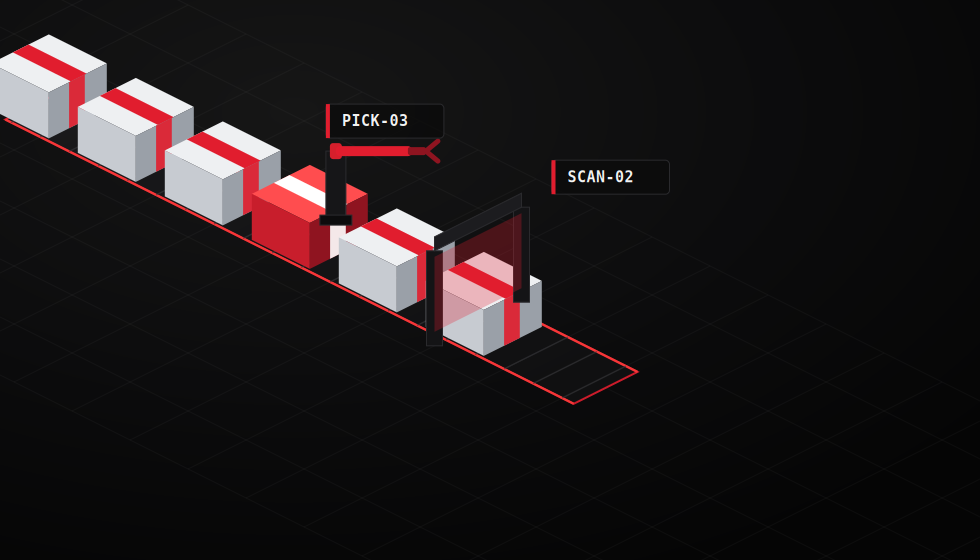

<div align="center">


<br/>


<br/><br/>

<a href="https://github.com/ryo-ma/github-profile-trophy">
  
</a>
</div>


<div align="center">

### 🏭 Factory Line — Live from the Floor



<sub>Pick-and-place + scan-station animation, now RGB-cycling — same real-time flow my MIS dashboards track on the shop floor.</sub>

</div>


## 🌈 About Me

<table>
<tr>
<td width="60%" valign="middle">

I build end-to-end web systems for manufacturing and corporate operations — bridging modern front-ends with legacy enterprise databases so data flows seamlessly from the shop floor to the executive dashboard.

```js
const phitiphoom = {
  role: "Software Developer / MIS Specialist",
  stack: ["Next.js", "TypeScript", "Prisma", "SQL Server", ".NET"],
  mission: "Turn legacy factory data into real-time dashboards",
  funFact: "Farms Slogbones between deploys 🐉"
};
```

</td>
<td width="40%" align="center">


</td>
</tr>
</table>


## 🏗️ Core Capabilities

| 🚀 | Capability | Description |
| :---: | :--- | :--- |
| 🌐 | **Web Apps** | Modern front-ends backed by legacy enterprise databases (Next.js App Router, Server Actions) |
| 🔐 | **Auth Systems** | Role-based access control (RBAC) + QR-badge login flows for shop-floor operators |
| 🖨️ | **Print Pipelines** | .NET print services, FastReport templates, automated PDF generation |
| 🖥️ | **Infrastructure** | Windows Server, reverse proxies (IIS/Nginx), self-contained .NET deployments |


## 🚀 Featured Systems & Projects

<table>
<tr>
<td width="33%" valign="top">

### 🏭 Dely PL Dashboard
Real-time production planning & factory floor metrics dashboard.


</td>
<td width="33%" valign="top">

### 🎫 IT-Helpdesk System
Support ticketing platform streamlining internal operations.


</td>
<td width="33%" valign="top">

### 📁 HR & Doc Control
Corporate document tracking & employee data visualization.


</td>
</tr>
</table>


## 💻 Tech Stack & Tools

<p align="center">
  <strong>Frontend & Frameworks</strong><br><br>
  
</p>

<p align="center">
  <strong>Backend, ORM & Databases</strong><br><br>
  
</p>

<p align="center">
  <strong>Infrastructure & Tools</strong><br><br>
  
</p>

<p align="center">
  <strong>Embedded & Robotics</strong><br><br>
  
</p>


## ⚡ Beyond the Screen

<table>
<tr>
<td width="33%" align="center">

### 📈
**Market Watcher**
NVIDIA · ASML · Tesla · IONQ
Chasing dividend-funded early retirement

</td>
<td width="33%" align="center">

### 🚗
**Automotive Nerd**
Deepal S05 · Geely EX5 · Volvo S90
EV & Hybrid specs, always comparing

</td>
<td width="33%" align="center">

### 🐉
**Monster Hunter**
Iceborne veteran
Farming Slogbones, one hunt at a time

</td>
</tr>
</table>


## 📊 GitHub Analytics

<div align="center">


</div>

<div align="center">

</div>

<br/>

<div align="center">

### 🐍 Contribution Snake


</div>

<br/>

<div align="center">

### 🧊 3D Contribution Graph


</div>


<div align="center">

</div>
